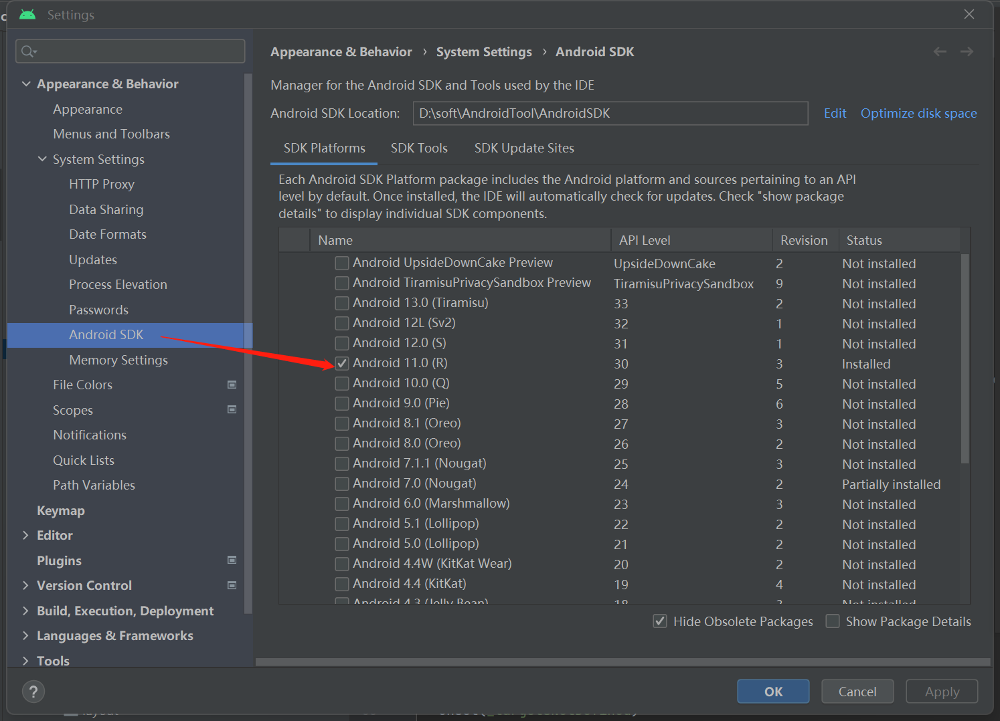
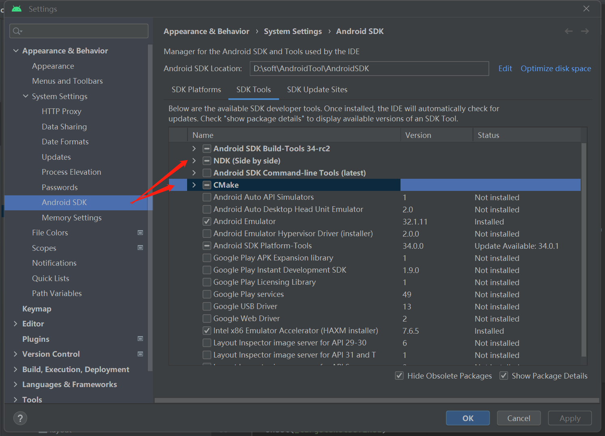
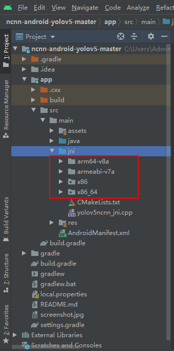
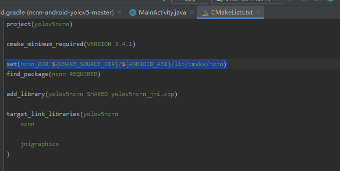

## NCNN是什么

`ncnn` 是腾讯公司开源的一个专为手机端极致优化的高性能神经网络前向计算框架。`ncnn` 从设计之初，就深刻考虑手机端的部署和使用，无需第三方依赖，跨平台，手机端 `cpu` 的速度快于目前所有已知的开源框架。基于 `ncnn`，开发者能够将深度学习算法轻松移植到手机端高效执行，开发出人工智能 `APP`，将 `AI` 带到你的指尖。

## 模型转化

当我们训练了自己的检测模型后，就需要一种中介，通过它，可以实现在不同框架之间进行转换。 `Open Neural Network Exchange` 简称 `ONNX`，意思是开放神经网络交换格式，它就是我们需要的中介。

- 安装依赖库

  ```
  pip install onnx coremltools onnx-simplifier
  ```

- 执行命令

  ```
  python models/export.py --weights runs/exp2/weights/best.pt
  ```

- 同时在 `best.pt` 的同级目录，还生成了 `best.onnx`、`best.mlmodel` 和 `best.torchscript.pt`

- 接下来使用工具 `onnx-simplifier` 来简化 `onnx`，执行命令

  ```
  python -m onnxsim runs/exp2/weights/best.onnx runs/exp2/weights/best-sim.onnx
  ```

- 下面开始编译 `ncnn`，首先准备基础环境

  ```
  sudo apt install build-essential libopencv-dev cmake
  ```

- 编译安装 `protobuf` 依赖库

  ```
  git clone https://github.com/protocolbuffers/protobuf.git
  cd protobuf
  git submodule update --init --recursive
  ./autogen.sh
  ./configure
  make
  make install
  sudo ldconfig
  ```

- 编译安装好以后，可以查看下 `protobuf` 的版本号

- 接下来，需要编译 `ncnn`，目的是生成 `onnx` 转 `ncnn` 的命令行工具

  ```
  git clone https://github.com/Tencent/ncnn.git
  cd ncnn
  git submodule update --init
  mkdir build
  cd build
  cmake ..
  make -j8
  make install
  ```

- 编译安装完成后，就可以使用 `onnx2ncnn` 工具进行转换了

  ```
  cd tools/onnx
  ./onnx2ncnn ~/Works/weights/best-sim.onnx ~/Works/weights/model.param ~/Works/weights/model.bin
  ```

- 接下来就可以替换原 `android` 工程中 `assets` 文件夹下的 `yolov5s.param` 和 `yolov5s.bin`

## 项目部署

- 设置你的android的版本，选择兼容的NDK和CMake,这里我选择的NDK是21.3.6528147，CMake是3.10.2.4988404（调了一下午，才找到与gradle版本不冲突的NDK和CMake版本）





- 下载`yolov5 for android` 的源码

```html
https://github.com/nihui/ncnn-android-yolov5
```

- 下载编译好的包，选择[ncnn-xxxxx-android-vulkan.zip]

```
https://github.com/Tencent/ncnn/releases
```

- 下载解压后拷贝到 `ncnn-android-yolov5` 项目的 `app/src/main/jni` 目录下，目录结构是这样的



- 然后修改同级目录下的 `CMakeLists.txt`，将其中的 `ncnn_DIR` 变量值修改成

```
set(ncnn_DIR ${CMAKE_SOURCE_DIR}/${ANDROID_ABI}/lib/cmake/ncnn)
```



然后就可以连接手机进行部署了！

------

想要了解更多yolo压缩技术可以参考下面博主[迷途小书童的Note - 编程、技术、分享迷途小书童的Note-- 编程、技术、分享 (xugaoxiang.com)](https://xugaoxiang.com/)

